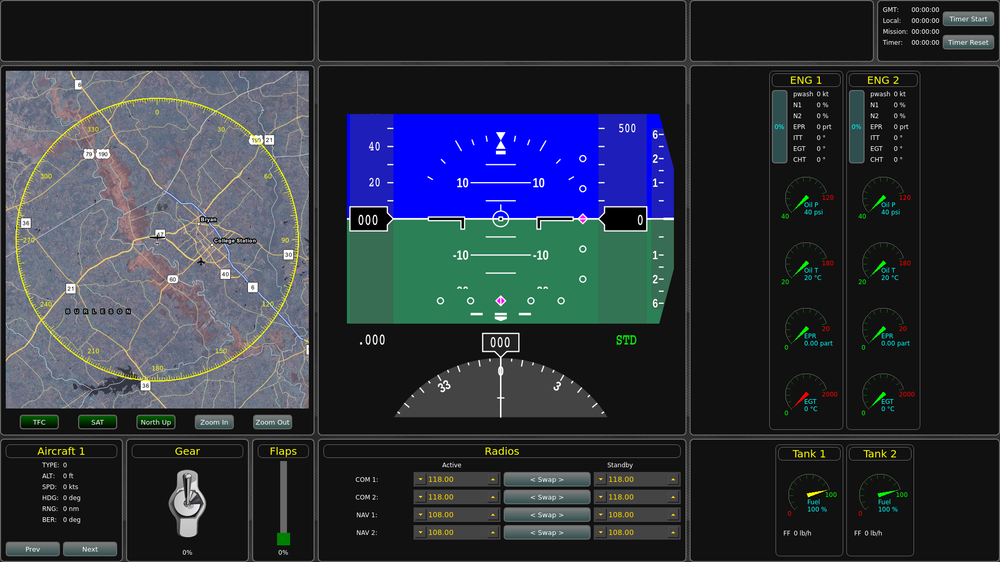
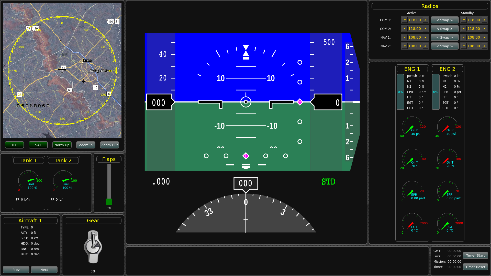

CPDisplay
=========
<a href="https://scan.coverity.com/projects/tamu-vscl-cpdisplay">
  
</a>

Cockpit Head Down Display for the Vehicle Systems and Controls Lab at Texas A&M University.

This display is designed to work with X-Plane 10, and provides many panels.  The display itself is reconfigurable with a series of INI files, allowing users to modify the size and arrangement of panels to suite their needs and display resolutions.





Dependencies
============
In addition to the dependencies listed below, in order to use Google Maps, you must have a Google Developer
account with both
[Google Maps JavaScript API](https://developers.google.com/maps/documentation/javascript/) and
[Google Maps Geocoding API](https://developers.google.com/maps/documentation/geocoding/) enabled.  The default map provider is currently [OpenLayers](http://openlayers.org/), which is free and does not require an account.

 Name                                       | Version     | Ubuntu Package  | OS X Homebrew Package | Notes
--------------------------------------------|-------------|-----------------|-----------------------|-------
[CMake](http://www.cmake.org/)              | 2.8.12+     | cmake           | cmake                 |
[Qt5](http://qt-project.org/)               | 5.6+        | qt5-default, libqt5svg5, libqt5svg5-dev | qt5 |
[QFI](http://marekcel.pl/index.php?pg=qfi)  | 2014-01-26  | -               | -                     | included *1
[Qt Dynamic Layout](https://github.com/tamu-vscl/qt-dynamic-layout) | - | - | -                     | submodule
[Qt Toggle Input](https://github.com/tamu-vscl/qt-toggle-input)     | - | - | -                     | submodule
[VSCL Sprites](https://github.com/tamu-vscl/sprites) | -  | -               | -                     | submodule
[CPD Map](https://github.com/tamu-vscl/cpd-map) | -       | -               | -                     | submodule

1. QFI - QFlightInstruments
  * Used for the Primary Flight Display and other instruments
  * Included in [ext/qfi](ext/qfi)


X-Plane 10
==========
Tested on X-Plane 10.36 and 10.45.

This program reads UDP data from X-Plane, and thus to function properly, the following UDP data should be enabled in the "Data Input & Output" window<sup>*1*</sup>, along with the checkbox to enable "internet" output (instructions below). <sup>*2*</sup>

1, 3, 4, 15-26, 34-50, 96, 97

Note <sup>*1*</sup>: As of version 1.1 (August 7, 2015), when flying on X-Plane 10.40b7, you no longer have to manually select each UDP output packet, since the new Dataref API allows selections to be made from another application.  The SwitchBoard class now does this for you, so all you have to do is turn on UDP output in X-Plane and send it to the computer running the Cockpit Display.

Note <sup>*2*</sup>: To turn on the UDP output in X-Plane, go to the "Settings" menu, then click "Net Connections".  In the Net Connections window, click on the "Data" tab.  Check the box for "IP of data receiver" and set the IP address to the (IPv4) address of the computer running your Cockpit Display, and set the port number to match the port found in the [cpd-settings.ini](config/examples/cpd-settings.ini) config file.  Also make sure that config file has the correct (IPv4) address for the computer running X-Plane so it can send the data requests.

Note <sup>*2*</sup> continued: To turn on the specific data (for X-Plane versions < 10.40b7), go to the "Settings" menu and click "Data Input & Output".  In the "Data Input & Output" window, under the "Data Set" tab, select the first checkbox in the row for all of the above data indices (the internet checkbox).  Also make sure the "enable: []internet" checkbox at the top right is selected.


Instructions
============
The easiest way to download and build this project is using Git and CMake (after installing non-included dependencies).  You must first make a config file following the example in [config/examples/cpd-settings.ini](config/examples/cpd-settings.ini).  All you really have to change is the IP address(es) and port(s) of the machine(s) running X-Plane.  Note that there is more setup required if using a Master Control Station (MCS) setup with multiple simulator systems.

The MCS setup instructions are also included in the [config/examples/cpd-settings.ini](config/examples/cpd-settings.ini) file, and support many instances of X-Plane in a lab to communicate with any number of Cockpit Displays (CPDs) in a one-to-many (X-Plane to CPDs) fashion.  We use this type of setup to allow Pilot/CoPilot CPDs to simultaneously communicate with one instance of X-Plane in our 2-seat T-37 cockpit, and to also mirror those displays to another larger screen for observation during user studies, flight demo's, etc.

```bash
$ git clone https://github.com/tamu-vscl/cpdisplay.git
$ git submodule init --update
$ cp config/examples/cpd-settings.ini config/cpd-settings.ini
## Change settings to fit your network/system
$ mkdir build && cd build
$ cmake ..
## With most systems these days, you can use `make -jX`, where X is a number of processes to spawn to speed up the build
$ make
## Optionally run from this directory or anywhere else you choose
$ ../bin/cpdisplay
```

The executable can be run from anywhere, as long as the config directory exists in the same structural location on the file system as this repo ( [project root]/bin/executable and [project root]/config/[files] )

